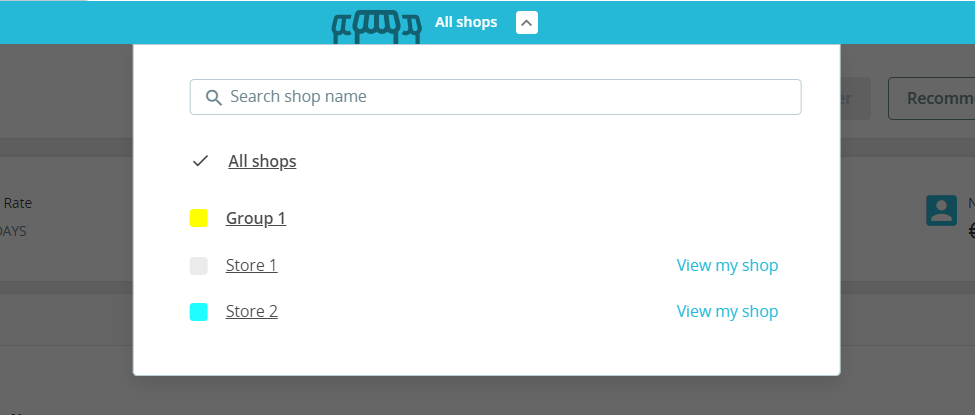

# The multistore interface

## The Multistore page  

### Understanding the multistore page organization

When the multistore feature is enabled, a new page is available under the **Advanced Parameters** menu: the **Multistore** page.

This page is divided into 3 sections:

* **Multistore tree: **The multistore tree gives you an overview of how your stores are organized into different groups. 
* **Multistore: **This table lists all the store groups you have created, whether they are enabled or not. 
* **Multistore options: **In this section, you can select the store you want to set as default.  


[adding-a-new-store.md](adding-a-new-store.md)



[adding-a-new-group-of-stores.md](adding-a-new-group-of-stores.md)



[setting-a-stores-url.md](setting-a-stores-url.md)


## Working in different contexts 


For version 1.7.8.0, PrestaShop and the open source community have worked on new features to facilitate the management of multiple stores. Those new features are not all available yet on all pages, so both old and new behaviors were documented here. 


### Knowing what context you are in

When multi-store is enabled, you can apply changes to either **all stores**, **a group of stores**, or **a specific store**, depending on the selected context.

* **All shops**: Changes will apply to all your stores.
* **Group X**: Changes will only apply to the stores in group X.
* **Store Y**: Changes will only apply to store Y.

#### The drop-down selector

The drop-down selector at the top of each page of the back office indicates the context you are working on. 

 (4) (2).png>)

#### The header (<mark style="color:orange;">from version 1.7.8.0</mark>)

From the 1.7.8.0 version, the multistore interface evolves and the drop-down selector turns into a header on most of the pages.  


The color of each store or group of stores can be customized on the **Advanced Parameters > Multistore **page. Depending on the store you are working on, the header will change color, allowing you to know at a glance what context you are in.


### Make changes to a group of stores or to a specific store

To apply changes to a group of stores or to a specific store, switch context with the drop down-selector or the header (from version 1.7.8.0) and select the group or the store you want to customize.

New options will appear on the page, allowing you to customize settings for the specific group or store selected:

* A multistore "Yes/No" toggle button
* A checkbox next to each parameter

To make changes:

1. To male all settings for a section editable, set the multistore toggle button to "Yes".  If you only want to customize a specific setting, check the box next to it.
2. Once a parameter is editable, make your changes and save.


Setting the multistore toggle to yes or checking a box makes the parameter(s) editable but doesn't change their value. It's up to you to make your adjustements and save.


#### Checkboxes (<mark style="color:orange;">from version 1.7.8.0</mark>)

Checkboxes are displayed when you are working in a single-store or group context. They allow you to modify a parameter for a specific store or a group of stores and keep a record of this change. Indeed, if the box is checked next time you'll go to the page, it means that the parameter was customized for the store or the group of stores you are working on. Unchecking the box will cancel the customization and the parameter will take the same value as in the "All shops" context (or the group context, if available).

For example, in the screenshot below, the box next to the maintenance text parameter is checked. This means that this parameter is customized in Store 1.

.png>)


For now, this feature is only available on the **Shop Parameters > Maintenance** page.


#### The specific settings drop-down (<mark style="color:orange;">from version 1.7.8.0</mark>)

Thanks to the specific settings drop-down, if you make changes to a specific store, and that you then go back to the "All shops" or group context, you'll be able to easily know which parameters have been modified in a specific store.

So, if you see this drop-down next to a parameter, it means that this parameter has been customized in at least one store. Deploy the drop-down to know which store(s) are concerned.

.png>)

**Customized**: The parameter was modified in the store.

**Inherited**: The parameter is set in the same way as in all stores.

 

**Categories**: A product can only appear in a given category of a shop if it has been associated with this category in that shop's context. In other words: if shop A and shop B have the C category in common, you can associate the P product to the C category for the A shop's context, and P will not appear in category C on shop B.

**Carriers**: You can manage the carriers' association on a per-shop basis, a per-shop-group basis or for all shops; but you cannot customize a carrier on a per-shop basis. You must duplicate the carrier if you want to use the same carrier with different price ranges on two shops.

**Products:** For each shop, you can set specific prices for every product, share part of the catalog or the whole of it, change product images, etc.

**Customers:** You can choose to share the customer accounts between your shops, enabling your customers to use the credentials between all shops, and even be transparently signed-in to each.

